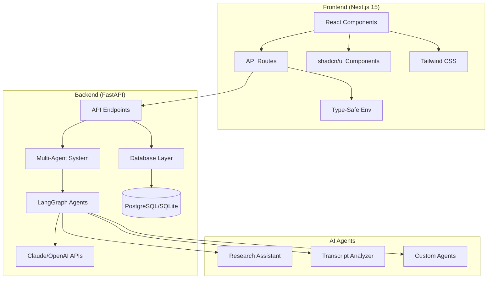

# Interview Insight AI

> **AI-Powered Interview Transcript Analysis Platform**

A production-ready, full-stack AI application that transforms interview transcripts into actionable insights using advanced language models and multi-agent AI systems. Built with modern technologies and industry best practices for developers, recruiters, and HR professionals.

[](https://python.org)
[](https://nextjs.org)
[](https://typescriptlang.org)
[](https://fastapi.tiangolo.com)
[](LICENSE)

## 🌟 What is InterviewInsight AI?

**InterviewInsight AI** is a sophisticated platform that leverages cutting-edge AI technology to analyze interview transcripts and extract meaningful insights. Whether you're a developer showcasing AI skills, a recruiter analyzing candidate interviews, or an HR professional reviewing performance discussions, this platform provides enterprise-grade transcript analysis capabilities.

### ✨ Key Features

- **🤖 Advanced AI Analysis**: Multi-agent system powered by LangGraph with Claude 3.5 Haiku integration
- **📊 Intelligent Insights**: Automatic timeline extraction, entity recognition, and sentiment analysis
- **🎯 Real-time Processing**: Live analysis with progress indicators and comprehensive results
- **🏗️ Production-Ready**: Docker containerization, comprehensive testing, and CI/CD ready
- **🎨 Modern UI/UX**: Responsive design with shadcn/ui components and smooth animations
- **🔧 Developer-Friendly**: Hot-reload, comprehensive documentation, and excellent tooling

## 🚀 Core Capabilities

### AI-Powered Transcript Analysis
- **Timeline Extraction**: Automatic parsing of timestamps and event categorization
- **Entity Recognition**: Identification of people, companies, technologies, and locations
- **Sentiment Analysis**: Highlights and lowlights extraction with confidence scoring
- **Topic Modeling**: Key topic identification and categorization
- **Structured Output**: JSON-formatted results for easy integration and analysis

### Multi-Agent AI System
- **Research Assistant**: Web search and mathematical calculations using DuckDuckGo
- **Transcript Analyzer**: Specialized agent for interview analysis with custom tools
- **Extensible Framework**: Easy addition of new agents and specialized capabilities
- **Conversation Threading**: Persistent state management across analysis sessions

### Full-Stack Architecture
- **Backend**: FastAPI with SQLAlchemy 2.0, async operations, and comprehensive API documentation
- **Frontend**: Next.js 15 with App Router, React 19, and TypeScript 5.8+
- **Database**: Flexible storage with PostgreSQL (production) or SQLite (development)
- **DevOps**: Docker Compose environments for development, testing, and production

## 🏗️ Architecture Overview



## 🛠️ Technology Stack

### Backend Technologies
- **Framework**: FastAPI (Python 3.11+)
- **AI/ML**: LangGraph, LangChain, Anthropic Claude, OpenAI
- **Database**: SQLAlchemy 2.0, PostgreSQL, Alembic migrations
- **Tools**: Pydantic V2, UV package manager, Pytest
- **Deployment**: Docker, Gunicorn, health checks

### Frontend Technologies
- **Framework**: Next.js 15 with App Router
- **Language**: TypeScript 5.8+ with strict mode
- **UI/UX**: shadcn/ui, Radix UI, Tailwind CSS 4.0, Framer Motion
- **Tools**: pnpm, ESLint, Prettier, T3 Env

### DevOps & Quality
- **Containers**: Docker & Docker Compose
- **Package Managers**: UV (Python), pnpm (Node.js)
- **Quality**: Ruff, MyPy, ESLint, Prettier
- **Testing**: pytest, Jest (ready), Playwright (ready)

## 🚀 Quick Start

### Prerequisites
- **Python 3.11+** (for backend)
- **Node.js 18+** (for frontend) 
- **Docker & Docker Compose** (optional, for PostgreSQL)
- **UV** (Python package manager)
- **pnpm** (Node.js package manager)

### 1. Clone the Repository
```bash
git clone <repository-url>
cd interview-insight-ai
```

### 2. Backend Setup

#### Option A: Quick Start (In-Memory Database)
Perfect for development and coding interviews:

```bash
cd backend
cp env.example .env
echo "STORAGE_TYPE=memory" >> .env

# Install dependencies
uv sync

# Start the backend
uv run python -m src.app.main
```

#### Option B: Full Setup (PostgreSQL)
For production-like development:

```bash
cd backend
cp env.example .env
# Edit .env with your settings

# Start with Docker
make dev-up

# Or manually start PostgreSQL and run:
# uv run python -m src.app.main
```

### 3. Frontend Setup
```bash
cd frontend
pnpm install

# Start development server
pnpm dev
```

### 4. Access the Application
- **Frontend**: http://localhost:3000
- **Backend API**: http://localhost:8000
- **API Documentation**: http://localhost:8000/docs
- **Interactive API**: http://localhost:8000/redoc

### 5. Optional: Add API Keys for AI Features
```bash
# In backend/.env
ANTHROPIC_API_KEY=your-anthropic-api-key
OPENAI_API_KEY=your-openai-api-key
```
*Note: The application works without API keys using mock responses for development.*

## 📁 Project Structure

```
interview-insight-ai/
├── backend/                          # FastAPI backend with AI capabilities
│   ├── src/
│   │   └── app/
│   │       ├── agents/               # Multi-agent AI system
│   │       │   ├── agent.py          # Agent registry and orchestration
│   │       │   ├── research_assistant.py  # Web search & calculation agent
│   │       │   ├── transcript_analyzer.py  # Interview analysis agent
│   │       │   └── tools.py          # AI tools (search, calculator, etc.)
│   │       ├── api/                  # REST API endpoints
│   │       ├── core/                 # Core application logic
│   │       ├── schemas/              # Pydantic data models
│   │       └── main.py               # Application entry point
│   ├── tests/                        # Comprehensive test suite
│   ├── docker/                       # Environment-specific Docker configs
│   ├── migrations/                   # Database migrations (PostgreSQL)
│   ├── pyproject.toml               # Python dependencies and tooling
│   └── README.md                    # Backend documentation
├── frontend/                         # Next.js 15 frontend
│   ├── src/
│   │   ├── app/                      # Next.js App Router
│   │   │   ├── page.tsx             # Homepage with transcript analyzer
│   │   │   ├── analysis/            # Analysis results page
│   │   │   └── api/                 # Backend proxy API routes
│   │   ├── components/              # React components
│   │   │   ├── ui/                  # shadcn/ui component library
│   │   │   ├── transcript-analyzer.tsx  # Main analysis interface
│   │   │   ├── analysis-dashboard.tsx   # Results visualization
│   │   │   └── ...                  # Other app components
│   │   ├── types/                   # TypeScript type definitions
│   │   └── env.js                   # Type-safe environment config
│   ├── package.json                 # Node.js dependencies and scripts
│   └── README.md                   # Frontend documentation
└── README.md                       # This file
```

## 🤖 AI Capabilities

### Available Agents

#### Research Assistant
- **Web Search**: Real-time information retrieval using DuckDuckGo
- **Mathematical Calculations**: Safe expression evaluation with NumExpr
- **General Q&A**: Claude-powered responses with conversation threading

#### Transcript Analyzer
- **Timeline Extraction**: Automatic parsing of timestamps and event categorization
- **Entity Recognition**: Identification of people, companies, technologies, locations
- **Sentiment Analysis**: Highlights and lowlights extraction
- **Topic Modeling**: Key topic identification and categorization
- **Structured Output**: JSON-formatted results for frontend integration

### Example Usage

```python
# Research Assistant
curl -X POST http://localhost:8000/api/v1/agent/research-assistant/invoke \
  -H "Content-Type: application/json" \
  -d '{
    "message": "What is the current population of Tokyo?",
    "model": "claude-3-5-haiku-latest"
  }'

# Transcript Analyzer
curl -X POST http://localhost:8000/api/v1/transcript/analyze \
  -H "Content-Type: application/json" \
  -d '{
    "transcript_text": "Interviewer: Tell me about your Python experience...",
    "model": "claude-3-5-haiku-latest"
  }'
```

## 🛠️ Development Workflows

### Backend Development
```bash
cd backend

# Quick development (in-memory)
echo "STORAGE_TYPE=memory" > .env
uv run python -m src.app.main

# Full development (PostgreSQL)
make dev-up                    # Start containers
make test                      # Run tests
make lint                      # Check code quality
make format                    # Format code

# Database management
make migrate                   # Create and apply migrations
make revision                  # Create new migration
make upgrade                   # Apply migrations only
```

### Frontend Development
```bash
cd frontend

# Development
pnpm dev                       # Start dev server with Turbo
pnpm build                     # Build for production
pnpm preview                   # Build and serve

# Code quality
pnpm lint                      # ESLint check
pnpm lint:fix                  # Fix ESLint issues
pnpm typecheck                 # TypeScript check
pnpm format:write              # Format with Prettier
```

### Full-Stack Development
```bash
# Terminal 1 - Backend
cd backend && echo "STORAGE_TYPE=memory" > .env && uv run python -m src.app.main

# Terminal 2 - Frontend  
cd frontend && pnpm dev

# Terminal 3 - Development commands
cd backend && make test        # Run backend tests
cd frontend && pnpm check     # Frontend quality checks
```

## 🧪 Testing

### Backend Testing
```bash
cd backend

# Run all tests
make test

# Run with coverage
make test-all

# Run in Docker environment
make test-env

# Specific test categories
uv run pytest tests/unit/     # Unit tests only
uv run pytest tests/integration/  # Integration tests only
```

### Frontend Testing (Ready for Implementation)
```bash
cd frontend

# When implemented:
pnpm test                      # Jest unit tests
pnpm test:watch               # Watch mode
pnpm test:e2e                 # Playwright E2E tests
```

## 🚀 Deployment

### Production Deployment

#### Backend Production
```bash
cd backend
make prod-up                   # Start production containers
```

Production features:
- Gunicorn with multiple workers
- PostgreSQL with persistent volumes
- Health checks and monitoring
- Environment-based configuration

#### Frontend Production
```bash
cd frontend
pnpm build                     # Build optimized bundle
pnpm start                     # Start production server
```

Production features:
- Optimized bundle with code splitting
- Static asset optimization
- Environment variable validation
- Performance monitoring ready

### Environment Configuration

#### Backend (.env)
```env
# Storage
STORAGE_TYPE=postgres          # or "memory" for development
POSTGRES_SERVER=localhost
POSTGRES_DB=interview_insight_db
POSTGRES_USER=postgres
POSTGRES_PASSWORD=your_password

# AI Configuration
ANTHROPIC_API_KEY=your-key
OPENAI_API_KEY=your-key

# Application
ENVIRONMENT=production
DEBUG=false
```

#### Frontend (.env.local)
```env
# Backend API URL
BACKEND_URL=http://localhost:8000

# Skip environment validation for Docker builds
SKIP_ENV_VALIDATION=false
```

## 🧹 Code Quality & Standards

### Backend Standards
- **Type Safety**: Full MyPy coverage with strict mode
- **Code Style**: Ruff for linting and formatting (120 char line length)
- **Testing**: 90%+ test coverage with pytest
- **Documentation**: Comprehensive docstrings and API documentation

### Frontend Standards
- **Type Safety**: Strict TypeScript with comprehensive type definitions
- **Code Style**: ESLint + Prettier with Tailwind class sorting
- **Components**: shadcn/ui patterns with accessibility standards
- **Performance**: Optimized bundle sizes and Core Web Vitals

### Shared Standards
- **Git**: Conventional commits with clear commit messages
- **Documentation**: README files for each major component
- **Environment**: Type-safe environment variable validation
- **Dependencies**: Regular updates with security monitoring

## 🔧 Customization & Extension

### Adding New AI Agents
1. Create agent module in `backend/src/app/agents/`
2. Implement using LangGraph patterns
3. Register in agent registry
4. Add API endpoints
5. Create frontend integration

### Adding Frontend Components
1. Use shadcn/ui CLI: `pnpx shadcn@latest add <component>`
2. Follow existing component patterns
3. Maintain accessibility standards
4. Add TypeScript definitions

### Database Extensions
1. Create Pydantic schemas
2. Add SQLAlchemy models
3. Generate migrations: `make revision`
4. Apply migrations: `make upgrade`

## 🤝 Contributing

### Development Process
1. **Fork** the repository
2. **Create** feature branch: `git checkout -b feature/amazing-feature`
3. **Commit** changes: `git commit -m 'feat: add amazing feature'`
4. **Test** thoroughly: Run test suites and quality checks
5. **Push** branch: `git push origin feature/amazing-feature`
6. **Create** Pull Request with detailed description

### Code Review Checklist
- [ ] Type safety maintained (no TypeScript errors)
- [ ] Tests added/updated for new functionality
- [ ] Documentation updated (README, docstrings)
- [ ] Code quality checks pass (linting, formatting)
- [ ] Performance impact considered
- [ ] Accessibility standards maintained
- [ ] Security implications reviewed

## 📈 Performance & Scalability

### Backend Performance
- **Async Operations**: Full async/await support with SQLAlchemy 2.0
- **Connection Pooling**: Database connection optimization
- **Caching**: Ready for Redis integration
- **Monitoring**: Health checks and metrics endpoints

### Frontend Performance
- **Core Web Vitals**: Optimized for LCP, FID, and CLS
- **Code Splitting**: Automatic route-based and dynamic imports
- **Image Optimization**: Next.js built-in image optimization
- **Bundle Analysis**: Built-in bundle analyzer

### Scaling Considerations
- **Horizontal Scaling**: Stateless design with external session storage
- **Database Scaling**: PostgreSQL with read replicas support
- **CDN Ready**: Static asset optimization for CDN distribution
- **Load Balancing**: Container-ready for orchestration platforms

## 🔒 Security

### Backend Security
- **Input Validation**: Pydantic models for all API inputs
- **SQL Injection Protection**: SQLAlchemy ORM with parameterized queries
- **Environment Variables**: Secure configuration management
- **CORS Configuration**: Proper cross-origin resource sharing setup

### Frontend Security
- **XSS Protection**: React built-in XSS protection
- **Type Safety**: TypeScript prevents many runtime errors
- **Environment Validation**: Type-safe environment variable handling
- **Dependency Scanning**: Regular security updates

### Production Security Checklist
- [ ] API keys stored securely (not in code)
- [ ] HTTPS enabled in production
- [ ] Database credentials secured
- [ ] CORS configured for production domains
- [ ] Input validation on all endpoints
- [ ] Error messages don't leak sensitive information

## 📚 Learning Resources

### Technologies Used
- **FastAPI**: [Official Documentation](https://fastapi.tiangolo.com/)
- **Next.js 15**: [App Router Guide](https://nextjs.org/docs/app)
- **LangGraph**: [Multi-Agent Documentation](https://langchain-ai.github.io/langgraph/)
- **shadcn/ui**: [Component Library](https://ui.shadcn.com/)
- **Tailwind CSS**: [Utility-First CSS](https://tailwindcss.com/)

### Best Practices
- **Python FastAPI**: [Best Practices Guide](https://fastapi.tiangolo.com/tutorial/)
- **React/Next.js**: [React Patterns](https://reactpatterns.com/)
- **TypeScript**: [TypeScript Handbook](https://www.typescriptlang.org/docs/)
- **Testing**: [Testing Best Practices](https://github.com/goldbergyoni/javascript-testing-best-practices)

## 🆘 Support & Troubleshooting

### Common Issues

#### Backend Issues
- **Port 8000 in use**: Use `lsof -ti:8000 | xargs kill -9` to free the port
- **Database connection**: Check PostgreSQL is running and credentials are correct
- **AI API errors**: Verify API keys are set correctly or use development mode

#### Frontend Issues
- **Port 3000 in use**: Next.js will automatically use the next available port
- **Build errors**: Run `pnpm install` to ensure all dependencies are installed
- **Type errors**: Run `pnpm typecheck` to identify and fix TypeScript issues

#### Environment Issues
- **UV not found**: Install UV following [official instructions](https://github.com/astral-sh/uv)
- **pnpm not found**: Install pnpm with `npm install -g pnpm`
- **Docker issues**: Ensure Docker Desktop is running and up-to-date

### Getting Help
1. **Check Documentation**: README files in backend/ and frontend/
2. **Review Issues**: Check existing GitHub issues for similar problems
3. **Enable Debug Mode**: Set `DEBUG=true` in backend environment
4. **Check Logs**: Review container logs with `docker logs <container-name>`
5. **Create Issue**: Open detailed issue with reproduction steps

## 📄 License

This project is licensed under the MIT License - see the [LICENSE](LICENSE) file for details.

## 🙏 Acknowledgments

- **FastAPI** for the excellent async Python framework
- **Next.js** team for the outstanding React framework
- **Anthropic** for Claude AI capabilities
- **Vercel** for shadcn/ui and development tools
- **LangChain** team for the AI/ML framework
- **Open Source Community** for the amazing tools and libraries

---

**Built with ❤️ for developers who want to ship AI-powered applications quickly and reliably.**

For detailed component documentation, see:
- [Backend Documentation](./backend/README.md)
- [Frontend Documentation](./frontend/README.md)
